# Crisis Resource Intelligence Network

[](https://github.com/saanitbansal-619/crisis-resource-intelligence-network/actions/workflows/tests.yml)


## Overview

Humanitarian crises create uneven demand for food, water, shelter, medical supplies, and personnel. Public sources such as ReliefWeb and GDACS publish alerts and situation reports, but turning that information into actionable resource intelligence requires ingestion, normalization, analytics, and accessible decision-support tooling.

This project is a full-stack portfolio system that ingests public crisis data, stores it in PostgreSQL, scores supply-demand mismatches using simulated NGO resource data, and presents priority needs through a FastAPI-backed Streamlit dashboard. It also includes deterministic transfer recommendations, an overall situation report, hybrid RAG retrieval over ReliefWeb/GDACS records, and optional local AI-assisted briefings via Ollama.

## Portfolio Note

This is a **portfolio prototype**, not a production emergency response system.

- **Public crisis context** comes from ReliefWeb and GDACS.
- **Operational inventory and resource request data are simulated** because real NGO supply data is generally not public.
- Transfer recommendations and AI briefings are decision-support outputs that require human review before any operational use.

## Live Demo

- **Dashboard:** [https://crisis-resource-dashboard.onrender.com](https://crisis-resource-dashboard.onrender.com)
- **API Docs:** [https://crisis-resource-api.onrender.com/docs](https://crisis-resource-api.onrender.com/docs)

> **Note:** The deployed demo may take 30–60 seconds to wake up on first load because it is hosted on a free Render instance.

**Hosted deployment note:**

- The deployed dashboard uses a live Render FastAPI backend and Render PostgreSQL database.
- Core dashboard features are available online: KPI overview, situation report, priority needs, surplus, resource balance, operational map, zone briefings, transfer recommendations, and retrieval-based crisis context.
- Semantic RAG retrieval and AI-assisted briefings use local Ollama in full local demo mode.
- In hosted Render mode, when Ollama is unavailable, retrieved crisis context falls back to keyword-based ReliefWeb/GDACS retrieval.
- AI-assisted briefings are shown as local-demo-only when Ollama is unavailable.

## Key Features

- ReliefWeb and GDACS ingestion
- PostgreSQL + pgvector storage
- Simulated NGO inventory and resource requests
- Supply-demand mismatch scoring
- Resource reallocation recommendations
- FastAPI backend
- Streamlit dashboard
- Operational map and zone briefings
- Hybrid RAG retrieval
- Optional local Ollama AI-assisted briefings
- Demo health check script

## Tech Stack

| Layer        | Technology                                              |
|--------------|---------------------------------------------------------|
| Ingestion    | Python, requests, pandas                                |
| Database     | PostgreSQL, pgvector, SQLAlchemy                        |
| Hosted DB    | Render PostgreSQL                                       |
| Local DB     | Docker Compose (PostgreSQL + pgvector)                  |
| Analytics    | SQL, pandas, scikit-learn (TF-IDF keyword scoring)      |
| Backend API  | FastAPI, uvicorn (Render Web Service when hosted)       |
| Dashboard    | Streamlit, Plotly (Render Web Service when hosted)        |
| Embeddings   | Ollama `nomic-embed-text` (768-dim, local demo mode)    |
| Generation   | Ollama `llama3.2` (local LLM, local demo mode)            |

## Architecture



This diagram shows the end-to-end system flow from public crisis-data ingestion through PostgreSQL-backed analytics, retrieval, optimization, FastAPI endpoints, and the Streamlit operations dashboard. Local Ollama support is optional and used for local semantic retrieval and AI-assisted briefing drafts.

The diagram source lives in [`docs/architecture/architecture.mmd`](docs/architecture/architecture.mmd). To regenerate the rendered assets with the [Mermaid CLI](https://github.com/mermaid-js/mermaid-cli):

```bash
npx @mermaid-js/mermaid-cli -i docs/architecture/architecture.mmd -o docs/architecture/architecture.svg
npx @mermaid-js/mermaid-cli -i docs/architecture/architecture.mmd -o docs/architecture/architecture.png
```

End-to-end pipeline:

```
ReliefWeb/GDACS ingestion
  → PostgreSQL storage
  → mismatch scoring
  → transfer recommendation engine
  → hybrid RAG retrieval with pgvector
  → optional local Ollama AI briefing
  → dashboard situation report and operational map
```

RAG pipeline:

```
ReliefWeb/GDACS crisis records
  → corpus building
  → document chunking
  → Ollama nomic-embed-text embeddings
  → PostgreSQL pgvector vector storage
  → hybrid semantic + keyword retrieval
  → metadata boosting by country/event/source
  → fallback labeling
  → local LLM briefing generation with Ollama llama3.2
```

## System Statistics

- 2 live humanitarian data sources integrated: ReliefWeb API and GDACS RSS feeds
- 10 crisis zones modeled in the demo database
- 7 organizations represented across inventory and request records
- 24 inventory records and 21 request records analyzed
- 90 GDACS alerts ingested
- 10 ReliefWeb crisis reports processed
- 24 resource mismatch records generated
- 10 optimized transfer recommendations generated
- 9,760 total simulated units moved in the optimized transfer plan
- 19.54M relative simulated transport-cost units minimized by the OR-Tools optimizer

Statistics reflect the deployed portfolio/demo dataset and may vary when the ingestion pipeline is rerun.

## Dashboard Screenshots

1. **Situation Overview — Operational Snapshot** — KPI cards for zones, shortages, surplus, and tracked gaps.

   

2. **Situation Overview — Overall Situation Report** — On-demand deterministic report with interpretation, priority zones, and transfers.

   

3. **Priority Needs** — Critical shortages ranked by mismatch score and urgency.

   

4. **Available Surplus** — Surplus zones and resources that may support redistribution.

   

5. **Resource Balance** — Net supply-demand gaps by resource type.

   

6. **Operational Map** — Zone markers colored by mismatch status with zone selection.

   

7. **Resource Transfer Recommendations** — Same-country and fallback transfer candidates for the selected zone.

   

8. **Zone Operational Brief** — Template-based operational briefing for a selected crisis zone.

   

9. **Retrieved Crisis Context** — Hybrid RAG results from ReliefWeb/GDACS records with fallback labeling.

   

10. **AI-Assisted Briefing** — Optional local Ollama draft labeled for coordinator review.

    

## Demo Health Check

Before running the dashboard demo, verify local services:

```bash
python -m scripts.health_check
```

Expected output when all services are available:

```
[OK] Database connection
[OK] FastAPI backend
[OK] RAG context endpoint
[OK] AI briefing endpoint
```

If Ollama is not running, the AI check may show a warning instead:

```
[WARN] AI briefing endpoint: Ollama may not be running
```

| Check | Verifies |
|-------|----------|
| Database connection | PostgreSQL is reachable using `DATABASE_URL` from `.env` |
| FastAPI backend | API is running at `http://127.0.0.1:8001/` |
| RAG context endpoint | Hybrid RAG retrieval works for `ZONE001` via `/reports/rag-zone-context/ZONE001` |
| AI briefing endpoint | Ollama-powered draft briefing works via `/reports/ai-zone-briefing/ZONE001` |

The AI briefing endpoint depends on **Ollama running locally** with **`llama3.2` available**. The dashboard still works without it; template briefs and retrieved context remain available when only PostgreSQL and FastAPI are running.

## How to Run Locally

### 1. Create venv and install requirements

```bash
cd CrisisResourceIntel
python -m venv venv

# Windows
venv\Scripts\activate

# macOS / Linux
source venv/bin/activate

pip install -r requirements.txt
```

### 2. Configure `.env`

```bash
cp .env.example .env
```

Set `RELIEFWEB_APPNAME` (ReliefWeb v2 requires a [pre-approved appname](https://apidoc.reliefweb.int/parameters#appname)), `DATABASE_URL`, `API_BASE_URL` (default `http://127.0.0.1:8001`), and `POSTGRES_PORT` (**5433**, matching `docker-compose.yml`). See [docs/env_setup.md](docs/env_setup.md).

### 3. Start Docker database

```bash
docker compose up -d
python -m database.test_connection
```

Docker uses the **pgvector/pgvector** image and maps host port **5433** to container port **5432**.

### 4. Run ingestion, cleaning, and loading scripts

Ingest public crisis data:

```bash
python -m ingestion.reliefweb_ingest
python -m ingestion.gdacs_ingest
```

Clean and load into PostgreSQL:

```bash
python -m ingestion.clean_reliefweb
python -m ingestion.clean_gdacs
python -m database.load_reports
```

Generate and load simulated resource data:

```bash
python -m database.generate_sample_resources
python -m database.load_resources
python -m analytics.mismatch_engine
```

| Table | Source |
|-------|--------|
| `crisis_reports` | `data/processed/reliefweb_reports_clean.csv` |
| `gdacs_alerts` | `data/processed/gdacs_alerts_clean.csv` |
| `organizations`, `zones`, `resource_inventory`, `resource_requests` | Simulated sample data |
| `mismatch_scores` | Derived from inventory and requests |

### 5. Start FastAPI

```bash
uvicorn backend.main:app --reload --port 8001
```

- Interactive docs: http://127.0.0.1:8001/docs
- Health check: http://127.0.0.1:8001/health

### 6. Start Streamlit

In a second terminal:

```bash
streamlit run dashboard/app.py
```

Dashboard URL: http://localhost:8501

### 7. Optional: Ollama and RAG setup

Required for **full local demo mode** with semantic RAG retrieval and AI-assisted briefings:

```bash
ollama pull nomic-embed-text
ollama pull llama3.2
ollama serve

python -m rag.build_corpus
python -m rag.chunk_documents
python -m database.create_rag_tables
python -m rag.embed_chunks
```

On the hosted Render demo, keyword-based retrieved crisis context is available without Ollama when `rag_chunks` data is loaded in PostgreSQL.

## Hosted Deployment

This project is deployed as a portfolio demo using [Render](https://render.com/):

| Component | Hosting |
|-----------|---------|
| FastAPI backend | Render Web Service |
| Streamlit dashboard | Render Web Service |
| PostgreSQL database | Render PostgreSQL |
| Local development database | Docker Compose with PostgreSQL + pgvector |
| Local AI/RAG mode | Ollama with `nomic-embed-text` and `llama3.2` |

**Live URLs:**

- Dashboard: [https://crisis-resource-dashboard.onrender.com](https://crisis-resource-dashboard.onrender.com)
- API docs: [https://crisis-resource-api.onrender.com/docs](https://crisis-resource-api.onrender.com/docs)

**Hosted behavior:**

- The dashboard reads from the deployed FastAPI API using `API_BASE_URL`.
- The backend reads from Render PostgreSQL using `DATABASE_URL`.
- The hosted dashboard supports keyword-based retrieved crisis context when local Ollama semantic retrieval is unavailable.
- AI-assisted briefings remain available in local demo mode with Ollama.

**Render start commands:**

FastAPI backend:

```bash
uvicorn backend.main:app --host 0.0.0.0 --port $PORT
```

Streamlit dashboard:

```bash
streamlit run dashboard/app.py --server.port $PORT --server.address 0.0.0.0
```

**Environment variables (no secrets in this README):**

| Service | Variable | Purpose |
|---------|----------|---------|
| Backend | `DATABASE_URL` | Render PostgreSQL connection string |
| Backend | `RELIEFWEB_APPNAME` | ReliefWeb ingestion (if run from hosted service) |
| Dashboard | `API_BASE_URL` | Public URL of the deployed FastAPI service |

Local default for `API_BASE_URL`: `http://127.0.0.1:8001`.

**Data loading for hosted demos:**

- Load crisis data, simulated resources, mismatch scores, and RAG chunks into the Render PostgreSQL instance before presenting the hosted dashboard.
- RAG features require `rag_chunks` records in the deployed database; semantic search additionally requires embeddings for full local hybrid mode.

## API Endpoints

| Prefix | Description |
|--------|-------------|
| `/crises` | ReliefWeb reports and GDACS alerts |
| `/resources` | Zones, organizations, inventory, requests |
| `/mismatches` | Shortage/surplus analytics with filters and reallocation recommendations |
| `/reports` | KPI overview, zone briefings, situation report, RAG context, AI briefings |

Key routes:

- `GET /health` — API and database connectivity
- `GET /reports/overview` — System KPIs
- `GET /reports/situation-report` — Deterministic overall situation report
- `GET /reports/zone-briefing/{zone_id}` — Consolidated zone briefing JSON
- `GET /reports/rag-zone-context/{zone_id}` — Hybrid-retrieved ReliefWeb/GDACS context
- `GET /reports/ai-zone-briefing/{zone_id}` — Optional local LLM-assisted draft briefing
- `GET /mismatches/critical` — Critical shortages
- `GET /mismatches/surplus` — Surplus resources
- `GET /mismatches/reallocation-recommendations` — Deterministic transfer recommendations
- `GET /mismatches/optimized-transfers` — OR-Tools optimized transfer plan (simulated cost units)

Examples (local):

- http://127.0.0.1:8001/reports/zone-briefing/ZONE001
- http://127.0.0.1:8001/reports/situation-report
- http://127.0.0.1:8001/reports/rag-zone-context/ZONE001
- http://127.0.0.1:8001/mismatches/reallocation-recommendations
- http://127.0.0.1:8001/mismatches/optimized-transfers

Examples (hosted):

- https://crisis-resource-api.onrender.com/reports/zone-briefing/ZONE001
- https://crisis-resource-api.onrender.com/reports/situation-report
- https://crisis-resource-api.onrender.com/reports/rag-zone-context/ZONE001
- https://crisis-resource-api.onrender.com/mismatches/reallocation-recommendations
- https://crisis-resource-api.onrender.com/mismatches/optimized-transfers

## Methodology

### Data sources

| Source | Description |
|--------|-------------|
| [ReliefWeb API](https://apidoc.reliefweb.int/) | Humanitarian reports and situation updates |
| [GDACS](https://www.gdacs.org/) | Disaster alerts and crisis event metadata |

### Supply-demand mismatch scoring

`analytics/mismatch_engine.py` compares available supply against requested demand by zone and resource type. It calculates shortage gap, shortage ratio, urgency weight, and mismatch score (`shortage gap × urgency weight`), then assigns status labels: surplus, stable, moderate shortage, severe shortage, or critical shortage.

```bash
python -m analytics.mismatch_engine
```

SQL query templates for shortages, surpluses, and summaries live in `analytics/queries/`.

### Resource reallocation recommendations

`analytics/reallocation_engine.py` matches shortage zones to surplus zones by resource type.

- **Same-country transfer candidates** are prioritized first (higher confidence).
- **Cross-country fallback candidates** are included when needed and labeled lower-confidence.
- Each recommendation includes quantity, source zone, destination zone, confidence level, match type, and a feasibility note.

The Operational Map dashboard shows prioritized transfers for the selected destination zone, with an expander for all recommendations.

### OR-Tools optimized transfer planning

`analytics/optimization_engine.py` complements the deterministic engine with a constrained minimum-cost transport model using Google OR-Tools.

- Surplus zones are supply nodes; shortage zones are demand nodes, matched by `resource_type`
- The solver minimizes **simulated transport cost** (relative cost units) while prioritizing demand fulfillment via unmet-demand penalties
- Same-country routes use lower simulated unit costs; cross-country fallback routes use higher costs
- Optimization cost is based on simulated distance and logistics assumptions for demonstration purposes. Values are relative cost units, not real-world USD estimates.
- Results are exposed at `GET /mismatches/optimized-transfers` and shown in the dashboard **Optimized Transfer Plan** section

### Overall Situation Report

`GET /reports/situation-report` returns a deterministic, template-based report across all zones. It is **not LLM-generated**. The report summarizes top priority zones, critical shortages, recommended transfers, recommended actions, operational interpretation, and limitations.

In the Situation Overview tab, users click **Generate Situation Report** to fetch it on demand. Operational Snapshot KPI cards remain the main dashboard metrics; the report section focuses on interpretation and operational detail.

### Map-based zone operational briefs

The Operational Map supports selected-zone briefing preview. Users select a zone, review a compact **Selected Zone** panel, then choose to view the **Zone Operational Brief**, download a PDF, or open copy-ready text.

Template-based briefs are the **stable default**—deterministic and grounded in PostgreSQL data. PDF export is optional via ReportLab (`pip install reportlab`).

### Hybrid RAG retrieval

Retrieved crisis context uses hybrid semantic + keyword search over ReliefWeb/GDACS chunks stored in PostgreSQL with pgvector when Ollama is available locally. Results are boosted by country, event type, and source metadata. If too few country-specific records match, fallback results are included and labeled `is_fallback: true`.

On the hosted Render demo, when Ollama is unavailable, the API falls back to keyword/metadata retrieval from `rag_chunks` in PostgreSQL and labels results with `retrieval_mode: keyword_fallback`.

### Local LLM-assisted briefings

AI-assisted operational briefings are generated **locally** using Ollama `llama3.2`. The prompt is grounded in structured zone metrics and retrieved context:

- The zone's related disaster alert is the **primary event**
- Retrieved sources are **supporting context only**
- The model is instructed **not to invent facts**
- The dashboard labels output as an **AI-assisted draft requiring review**

AI briefings are optional and on-demand. They do not replace template briefs, PDF export, or copy actions.

## Limitations

This is a **portfolio prototype**, not a production emergency response system:

- Operational inventory and resource request data are **simulated prototype data**, not real NGO supply systems
- Public humanitarian records depend on ReliefWeb and GDACS availability and coverage
- **Transfer recommendations must be validated by field coordinators** before dispatch
- **Cross-country fallback transfers** require customs, logistics, and partner review before action
- AI-assisted briefings are **drafts** and should be reviewed before any operational use
- The system does not make final operational decisions and should not be presented as production-ready

## Development Timeline

| Phase | Delivered |
|-------|-----------|
| Week 1 | Project setup; ReliefWeb and GDACS ingestion to `data/raw/` |
| Week 2 | Cleaning scripts, PostgreSQL schema, loader for `crisis_reports` and `gdacs_alerts` |
| Week 3 | Simulated organizations, zones, inventory, requests; mismatch scoring engine |
| Week 4 | FastAPI backend exposing crises, resources, mismatches, and reports |
| Week 5 | Streamlit dashboard with situation overview, priority needs, surplus, balance, and operational map |
| Week 6 Part 1 | Zone briefing endpoint; map-based template operational briefs with PDF/copy export |
| Week 6 Part 2 | pgvector RAG corpus, hybrid retrieval, optional Ollama AI briefings, demo health check |
| Extensions | Resource reallocation recommendations; Overall Situation Report; dashboard polish; Render deployment |
| Current enhancement | Google OR-Tools optimized transfer planning (`GET /mismatches/optimized-transfers`) |

Possible next steps: ML shortage-risk prediction, scheduled ingestion, and cloud hardening beyond the current portfolio demo.

## Current Enhancement: OR-Tools Optimized Transfers

The **Optimized Transfer Plan** complements baseline deterministic reallocation recommendations:

- **Google OR-Tools** solves a minimum-cost transport problem with supply, demand, and non-negativity constraints
- **Same-country routes** receive lower simulated unit costs; **cross-country fallback** routes use higher costs
- **Distance-based cost** uses zone coordinates when available; otherwise a simple simulated distance is applied
- Optimization cost is based on simulated distance and logistics assumptions for demonstration purposes. Values are relative cost units, not real-world USD estimates.
- **Recommendations require human validation** before operational dispatch; the optimizer does not replace field coordinator judgment

## Project Structure

```
CrisisResourceIntel/
├── .github/workflows/   # CI workflow for running tests on push and pull requests
├── ingestion/           # API fetchers, clean_reliefweb.py, clean_gdacs.py
├── database/            # Schema, loaders, sample resource generator
├── analytics/           # Mismatch engine, reallocation, OR-Tools optimization, SQL queries
├── backend/             # FastAPI application
├── dashboard/           # Streamlit UI
├── scripts/             # Demo health check and utilities
├── ml/                  # Shortage-risk prediction (future)
├── rag/                 # Corpus, embeddings, hybrid retrieval, LLM briefing
├── data/                # Raw, processed, and sample data
├── docs/                # Architecture and dev notes
├── docs/architecture/   # architecture diagram source and rendered assets
└── tests/               # pytest suite for API, analytics, optimization, RAG fallback, and config checks
```

## Running Tests

```bash
pytest
```

The suite is lightweight and runs locally without external APIs, Render services, or Ollama:

- **API tests** use FastAPI's `TestClient` (root and `/health` always run; `/reports/overview` and `/mismatches/optimized-transfers` skip gracefully when PostgreSQL or sample data is unavailable).
- **Analytics tests** cover the mismatch and reallocation engines as pure functions (shortage/surplus/stable status, urgency weighting, same-country vs. cross-country confidence, resource-type matching).
- **Optimization tests** validate the OR-Tools engine result shape and constraints, skipping if `ortools` is not installed.
- **RAG fallback tests** exercise keyword/hosted-mode context building without Ollama.
- **Config tests** verify API base URL resolution and that database URLs are masked so passwords are never exposed.

Database-backed tests print a clear skip message when PostgreSQL is not reachable.

## License

MIT License
